# How the Library Attendance System Works 
*(A Simple Guide for Library Managers)*

This guide explains exactly how and when students can mark their attendance, and what happens behind the scenes. 

## 🕒 The Daily Timeline

Here is a visual timeline of a typical day at the library. 
*(Example: The library opens at 9:00 AM, closes at 8:00 PM, and gives students a 60-minute "padding" grace period to scan out).*

```mermaid
gantt
    title Daily Attendance Timeline (Example: 9 AM to 8 PM + 1 Hr Padding)
    dateFormat  HH:mm
    axisFormat  %H:%M

    section Building Hours
    Doors Closed (Night)        :done,    00:00, 09:00
    Library is OPEN             :active,  09:00, 20:00
    Grace Period (Padding)      :active,  20:00, 21:00
    Doors Closed (Night)        :done,    21:00, 23:59

    section QR Scanner
    Scanner is OFF              :done,    00:00, 09:00
    Scanner is ON (Can Scan)    :active,  09:00, 21:00
    Scanner is OFF              :done,    21:00, 23:59

    section Automated System
    Midnight: Prepare System    :crit, 00:00, 01:00
    Cutoff: Mark Absentees      :crit, 21:00, 22:00
```

---

## 📖 Simple Step-by-Step Explanation

### 1. Midnight: A Fresh Start 🌙
Every night at 12:00 AM, the system wakes up and creates a **blank attendance sheet** for the new day. Every active student is put on this list as *"Pending"* (waiting to arrive). 
- A new, fresh QR code is automatically created for the day.

### 2. Morning: Opening Time 🌅
At **9:00 AM** (Opening Time), the QR scanner officially turns on. 
- If a student tries to scan *before* 9:00 AM, the system will politely say: *"The library is not open yet."*

### 3. During the Day: Scanning In & Out 📱
Between **9:00 AM and 8:00 PM**, students scan the QR code.
- **First Scan:** The system marks them as **Present** and logs their arrival time.
- **Second Scan (Leaving):** The system updates their record to show they checked out. 

### 4. Evening: The "Grace Period" (Padding) ⏳
The library officially closes at 8:00 PM. However, to account for students packing up or waiting in line, the system adds a **Padding Time** (e.g., 60 minutes).
- **8:00 PM to 9:00 PM:** The QR scanner remains ON. Students can still scan to check out without getting an error.

### 5. Night: The Final Cutoff 🛑
At **9:00 PM** (Closing Time + Padding Time), the attendance window completely slams shut. 
- The system checks the attendance sheet.
- Anyone who is still marked as *"Pending"* (meaning they never scanned the QR code all day) is officially marked as **Absent**.
- The system automatically sends a notification to the absent students.

---

## 🙋 Frequently Asked Questions

**Q: What if I manually mark a student present in the admin dashboard?**
**A:** You can manually mark a student present at any time! However, if you mark them present *after* the scanner turns on (e.g. after Opening Time + Padding), the system will flag them as **"Late"** so you know they didn't arrive on time.

**Q: Can a student check in at 8:30 PM during the Grace Period?**
**A:** Yes! As long as the scanner is ON, they will be marked Present. The grace period acts as an extension of the library hours for the QR code.

**Q: What happens on Holidays?**
**A:** If you add a Holiday in the admin dashboard, the system is smart enough to skip everything. No QR code is generated, and nobody is marked absent.
